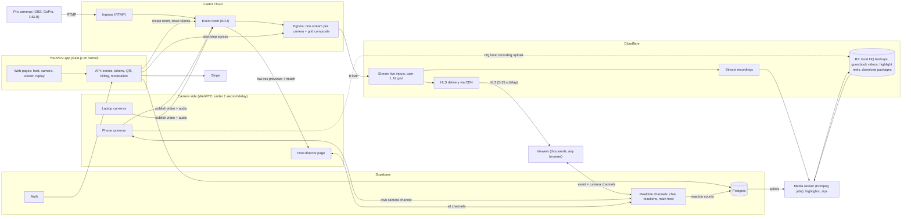

# YourPOV — Architecture

_Status: v1 draft (proposed). Reasoning for each choice is in `DECISIONS.md`._

## 1. Product overview

**Problem.** Event livestreams (weddings, parties, graduations) usually use one phone. Remote viewers miss most of what happens, and nobody can choose what to look at.

**Idea.** Turn every guest's phone or laptop into a camera for one shared stream. Viewers watch from any browser, switch between cameras, see all cameras at once in a grid, and react to the whole event or to one camera. After the event, the host gets a synced multi-camera replay, an automatic highlight reel, and a download package.

### Roles

| Role | Device | What they do |
|---|---|---|
| **Host** | Phone or laptop | Creates the event, shares the QR code, directs the stream (main feed, labels, pins, mute, remove), picks the audio source, moderates, pays |
| **Camera operator** | Phone or laptop browser | Scans the QR code, streams camera + mic, mutes own mic, zooms and flips camera, sees reactions for their own camera |
| **Pro camera** (Pro tier) | OBS, GoPro, DSLR via RTMP | Videographer's professional camera joins as a normal camera |
| **Viewer** | Any browser | Watches the main feed, one camera, or the grid; picture-in-picture; rewinds while live; chats and reacts; leaves a video guestbook message |

## 2. System diagram



## 3. Two delivery paths

| | Camera side | Audience side |
|---|---|---|
| Who | Host + camera operators (dozens) | Viewers (thousands) |
| Technology | WebRTC via LiveKit room | HLS via Cloudflare Stream CDN |
| Delay | Under 1 second | About 5-15 seconds |
| Why | Two-way, interactive, low delay | Cheap and scalable to very large audiences |

The bridge is **LiveKit egress**: it converts each camera, plus a grid composite, into a stream pushed to a Cloudflare Stream live input.

During the early spike (Phase 1), viewers can join the LiveKit room directly over WebRTC. The viewer page only swaps its player when moving to HLS; the camera side does not change.

## 4. Camera side (ingest)

- Cameras join from the browser. No app install. Works on phones (iOS Safari, Android Chrome) and laptops.
- **Join flow:** the host shows a QR code, which is a link like `https://<domain>/e/<eventCode>/camera`. The API checks the event and plan limits, then issues a short-lived LiveKit token with the `camera` role.
- **Device picker:** choose camera and microphone (laptops often have several).
- **Zoom and front/back flip** on phones (zoom where the browser supports camera zoom constraints).
- **Mic mute:** camera operators mute/unmute themselves with a clear on-screen indicator. The host can mute any camera remotely.
- **"You're live" indicator** is always visible on camera devices.
- **Simulcast** is on, so the host director page receives low-resolution previews of all cameras.
- **Camera health:** each camera reports battery level, network quality, and whether the screen is about to lock. Shown on the host director page with warnings.
- **Phone reliability:**
  - iOS stops the camera when the screen locks or the browser goes to the background. Use the Wake Lock API and show a "keep this screen open" banner.
  - Default to 720p for the live stream to limit battery drain and heat.
  - Recommend cellular data over venue Wi-Fi; show a connection-quality indicator.
  - Camera access requires HTTPS.
- **Pro cameras (Pro tier):** videographers connect OBS, GoPro, or DSLR encoders over RTMP through LiveKit Ingress. They appear as normal cameras.

### Local high-quality backup recording

Venue internet is often poor, so the live stream may be low quality. In parallel:

1. The camera page records locally at full quality with the browser's `MediaRecorder` API.
2. Chunks upload to R2 in the background when bandwidth allows, and the rest uploads after the event (resumable; the page shows upload progress and asks the operator to keep it open or come back later).
3. Replays and highlight reels use the HQ file when it exists, falling back to the Stream recording.

Limits to handle: phone storage space, iOS `MediaRecorder` format differences, and operators closing the page before uploading.

## 5. Audience side (delivery)

- Each camera and the grid become one Cloudflare Stream live input. Viewers play them with **hls.js** (native HLS on iOS Safari).
- **Main feed (default view):** the host picks a featured camera. Viewers who have not chosen a camera watch the main feed, which follows the host's choices. The current main feed is broadcast on the event realtime channel, and the viewer player switches source.
- **Auto-director:** when turned on, the main feed automatically switches to the camera with the most reactions over a recent window (for example the last 20 seconds), with a minimum time on each camera (for example 15 seconds) to avoid jumpy switching. The host can override at any time.
- **Camera labels and pins:** the host names cameras ("Altar", "Dance floor"), reorders, pins, or hides them.
- **Single camera view:** the viewer taps any camera to watch it directly.
- **Grid view ("security guard" view):** LiveKit RoomComposite egress combines all cameras into one grid video on the server. Viewers download one stream, not N, so it works well on phones. The grid plays the host's audio source (see section 6).
- **Picture-in-picture:** the main feed large plus a second camera small. Costs the viewer two streams, so the small one uses a low rendition.
- **Rewind while live:** HLS supports seeking back within the live window, with a "Jump to live" button.
- **Schedule and countdown:** before going live, viewers see an event page with the schedule and a countdown ("Ceremony starts in 12:30").
- **Lobby:** cameras can join before the event goes live to test video and audio. Viewers do not see lobby cameras.

## 6. Audio

Many microphones cannot play at once. The **host is responsible for audio**.

| View | Audio |
|---|---|
| Single camera | That camera's audio |
| Main feed | The host's audio source |
| Grid | The host's audio source |

- The host picks an **audio source** (for example the phone nearest the speakers).
- **If the host has not picked one:** use the host's own camera if the host is streaming, otherwise the first camera that joined. The director page shows "Audio: Camera 1 (automatic) · Change".
- **Handover:** if the audio camera disconnects or mutes, audio moves to the next connected camera (in join order). If the original camera comes back, audio stays where it is unless the host changes it.
- Audio does not follow the main feed automatically, so auto-director switches do not make the sound jump around.
- In the grid, the tile whose audio is playing shows a 🔊 icon. Viewers can mute the grid with the normal player mute button.
- The grid is one combined video, so its audio is baked in. To hear a different camera, the viewer opens that camera's own view.
- Muted cameras send no audio in any view.

## 7. Event lifecycle and reconnection

**An event stays alive when cameras go offline.** Cameras dropping out (battery, network, someone closing the page) is normal. The event only ends when the host ends it.

### Event states

```
scheduled -> lobby -> live <-> standby
                        live <-> paused   (host no-filming pause)
                        live / standby / paused -> ended   (host ends, or auto-end)
```

| State | Meaning |
|---|---|
| `scheduled` | Created; countdown page for viewers |
| `lobby` | Cameras can join and test; viewers still see the countdown |
| `live` | At least one camera is streaming |
| `standby` | Event is live but **no cameras are connected** |
| `paused` | Host pressed no-filming pause |
| `ended` | Host ended the event; viewer link becomes the replay page |

### When all cameras go offline (`standby`)

- **Links stay active.** The viewer link, the camera QR link, and the host director page all keep working.
- **Viewers** stay on the page and see a "Cameras are offline, the stream will resume shortly" screen. Chat and reactions keep working. The player reconnects automatically when a camera comes back; viewers do not need to refresh.
- **Main feed:** when the main feed camera drops, the main feed moves to the next available camera. When none are left, viewers see the standby screen.
- **Host:** the director page shows which cameras dropped and when, and a "No cameras live" warning. The host can share the QR code again.

### Rejoining

- **Same camera slot:** each camera device stores a rejoin key in the browser. Reopening the same link on the same device reclaims the same camera: same label, same chat channel, same Stream live input, and recordings continue on that camera's timeline.
- **New device:** joins as a new camera.
- **Host:** host rights belong to the host's account, not to a device or a camera. If the host's phone dies, the host signs in on another device and opens the director page. The host's camera can drop without affecting host controls.

### Behind the scenes

- The LiveKit room may close when empty. That is fine: the event lives in our database, not in LiveKit. The next camera to join recreates the room with the same name.
- Our API listens to **LiveKit webhooks** (participant joined/left, track published/unpublished) to update camera status and the event state, and to start or stop egress.
- Each camera keeps its **Cloudflare Stream live input** for the whole event, so viewer stream URLs never change. The live input's recording `timeoutSeconds` is set so short drops continue the same recording; longer drops start a new recording segment. The `recordings` table stores all segments per camera with timestamps, and the replay timeline shows the gaps.
- The **grid egress** stops when no cameras are connected (no cost while empty) and restarts when the first camera rejoins.

### Ending

- The host clicks **End event**. Egress stops, live inputs are disabled, and the viewer link becomes the replay page.
- **Auto-end safety:** if an event stays in `standby` with no cameras for a long time (for example 2 hours), the host gets a notification, and the event ends automatically after a further grace period. This stops forgotten events from running up costs.

## 8. Chat and reactions

Viewers are not in the LiveKit room, so chat runs on a separate real-time service: **Supabase Realtime** (alternatives: Ably, Cloudflare Durable Objects).

### Channels

```
event:<eventId>              whole-event chat, reactions, main-feed changes
event:<eventId>:cam:<camId>  chat and reactions for one camera
```

- Viewers subscribe to the event channel plus the channel of the camera they are watching. Switching cameras switches the camera subscription.
- Comment box toggle: **To everyone** / **To this camera**.
- Grid view shows the event channel; per-camera reaction counts can float over each tile.
- Camera operators subscribe to their own camera channel and see reactions and comments live, so viewers can direct them.
- The host sees all channels.

### Scale

- Reactions are **batched on the server** into counts per channel per second (for example "❤️ ×240") and stored in `reaction_counts`. These counts also drive the auto-director and highlight detection.
- Rate limits per viewer.
- Viewers are 5-15 s behind the cameras, so operators see reactions to moments from about 10 s ago. The operator UI should make this clear.
- Chat messages are stored in Postgres so they can appear in replays.

## 9. Safety and moderation

- **Moderation:** the host (and optional co-hosts) can delete messages, ban viewers, and turn on slow mode. A profanity filter runs on messages before they are broadcast.
- **Private events:** optional viewer password or invite-only guest list.
- **No-filming periods:** the host can pause all cameras (for example "no cameras during the vows"). Viewers see a "Paused by host" screen and nothing is recorded during that time.
- **Camera removal:** the host can remove any camera immediately.
- Event codes are long and random, so links cannot be guessed. LiveKit tokens are issued by the API only, short-lived, and scoped to one room and one role.

## 10. After the event

### Synced multi-camera replay

- Every camera, the grid, and main-feed switches are stored with timestamps on a shared event clock.
- The replay page shows one timeline; viewers switch cameras or grid and stay at the same moment.
- Chat and reactions replay alongside the video.

### Automatic highlight reel

1. After the event, the media worker scans `reaction_counts` for **spikes**: seconds where reactions are much higher than the recent average.
2. For each spike, it takes a window from **1 minute before to 2 minutes after** the spike (3 minutes total).
3. Camera choice: a spike on a camera channel uses that camera. A spike on the event channel uses whatever the main feed showed at that time.
4. Overlapping windows on the same camera are merged into one clip.
5. Clips are joined **in chronological order** into one highlight video, stored in R2.
6. Uses the HQ local backup when available, otherwise the Stream recording (Cloudflare Stream can create clips by start/end time).

The host can review and remove clips before sharing.

### Video guestbook

Remote viewers record a short video message for the host (browser `MediaRecorder`, time-limited), uploaded to R2. The host sees them all after the event.

### Download package (host)

The host downloads from the event dashboard:

- **Grid video:** the grid is recorded as its own Stream live input. The dashboard's "Download grid" button asks Cloudflare Stream to create an MP4 of that recording, waits until it is ready, and gives the host a download link. Audio-only (M4A) is also available.
- **Each camera:** same flow per camera, using the HQ backup file from R2 when it exists.
- **Highlight reel** and **guestbook videos** from R2.
- **Chat log** as a text or CSV file.
- **Everything at once:** the media worker builds a ZIP in R2 and emails the host a link.

Note: Cloudflare bills each MP4 download like watching the video once, so downloads are limited per plan.

### Host analytics

Peak and total viewers, watch time per camera, most-watched camera, and the most-reacted moments (which link into the replay).

## 11. Backend and data

- **Next.js (TypeScript)** app on **Vercel**: web pages plus API routes.
- **Supabase**: Postgres database, authentication (hosts need accounts; viewers and camera operators can be anonymous with a display name), Realtime.
- **Media worker:** a small background service running FFmpeg jobs (highlight reels, ZIP packages). Vercel functions have time limits, so this runs separately (for example Cloudflare Containers, Fly.io, or Railway). Not needed until Phase 6.

### Core entities (draft)

| Entity | Key fields |
|---|---|
| `users` | id, email, plan |
| `events` | id, host_id, code, title, status (scheduled/lobby/live/standby/paused/ended), plan_tier, audio_source_camera_id, main_feed_camera_id, auto_director, password_hash, starts_at |
| `event_schedule_items` | id, event_id, title, starts_at |
| `cameras` | id, event_id, rejoin_key_hash, label, sort_order, pinned, hidden, operator_name, device_type (phone/laptop/pro), status, livekit_participant_id, stream_input_id, hq_backup_key |
| `camera_health` | camera_id, battery, network_quality, updated_at |
| `main_feed_log` | event_id, camera_id, switched_at, switched_by (host/auto) |
| `messages` | id, event_id, camera_id (null = whole event), author_name, body, deleted, created_at |
| `bans` | event_id, viewer_id, created_at |
| `reaction_counts` | event_id, camera_id, emoji, bucket_second, count |
| `recordings` | id, event_id, camera_id (null = grid), stream_video_id, started_at, duration (many segments per camera if it reconnects) |
| `highlights` | id, event_id, camera_id, start_at, end_at, peak_at, included |
| `guestbook_entries` | id, event_id, author_name, video_key, created_at |
| `viewer_sessions` | event_id, viewer_id, camera_id, started_at, ended_at (for analytics) |
| `subscriptions` | user_id, stripe_customer_id, tier, status |

## 12. Plans and paywall (draft)

Costs grow mainly with **viewer minutes**, then with cameras, recording, and downloads. Pricing should follow that.

| | Free | Paid | Pro (videographers) |
|---|---|---|---|
| Cameras | 2-3 | More per tier | Many + RTMP pro cameras |
| Viewers | Small cap (for example 50) | Larger caps up to thousands | Highest caps |
| Grid, main feed, chat | Yes | Yes | Yes |
| Recording, replay, highlights | No | Yes | Yes |
| Downloads | No | Limited | More |
| Custom branding | No | No | Yes |

Payments via **Stripe Checkout** (subscriptions and one-time event passes).

## 13. Infrastructure, testing, costs

### Services

| Need | Service |
|---|---|
| Web app + API | Vercel |
| Camera side (WebRTC), pro camera ingress, egress | LiveKit Cloud |
| Audience delivery, recording, clips, MP4 downloads | Cloudflare Stream |
| HQ backups, guestbook, highlights, packages | Cloudflare R2 |
| Media processing | Media worker (FFmpeg) |
| Database, auth, realtime | Supabase |
| Payments | Stripe |

Environments: local, staging, production. Each has its own keys in `.env` files (never committed).

### Testing

- **Unit tests** for API logic (token issuing, plan limits, spike detection, clip window merging, auto-director switching rules).
- **Playwright end-to-end tests** with Chrome's fake camera (`--use-fake-device-for-media-stream`, `--use-fake-ui-for-media-stream`): open several camera pages and viewer pages at once, then check camera switching, main feed, grid, mute, per-camera chat, and moderation.
- **Manual device matrix** before each release: iPhone Safari, Android Chrome, macOS/Windows laptop, on Wi-Fi and cellular.
- GitHub Actions runs lint and tests on every PR.

### Cost drivers (check current pricing before relying on these)

- Cloudflare Stream: $1 per 1,000 minutes delivered, $5/month per 1,000 minutes stored. MP4 downloads bill like one viewing. Example: 2,000 viewers × 3 h = 360,000 minutes, about $360 per event.
- LiveKit: WebRTC minutes, bandwidth, and transcode minutes for egress (about cameras + 1 grid × event length), plus ingress for pro cameras.
- R2: storage for HQ backups (large files; set a retention period per plan).
- Supabase, Vercel: free tiers during development.

## 14. Delivery phases

1. **Spike:** a phone and a laptop publish into a LiveKit room; one watch page (WebRTC); mic mute. Prove it on real devices over cellular.
2. **Multi-camera event:** create event, QR join, device picker, zoom/flip, host director page with camera health, labels, pins, remote mute, audio source, main feed, lobby.
3. **Scale path:** egress to Cloudflare Stream, grid composite, HLS viewer page with main feed, camera switching, grid, picture-in-picture, rewind while live, schedule and countdown.
4. **Chat, reactions, moderation:** realtime channels, batching, auto-director, moderation tools, private events, no-filming pause.
5. **Accounts and paywall:** host accounts, Stripe, plan limits.
6. **After the event:** recordings, local HQ backup upload, synced replay, highlight reel, guestbook, downloads, analytics.
7. **Pro tier:** RTMP pro cameras, custom branding.

## 15. Not in v1

| Feature | Status |
|---|---|
| Live captions and translation | Planned for a later update |
| Clip sharing by viewers ("save last 30 s") | Not planned |
| Landscape and stability guidance for operators | Not planned |
| Virtual gifts and tips | Not planned |
| Native iOS/Android apps | Only if browser limits become a blocker |

## 16. Risks

- iOS browser limitations (screen lock, background tabs, battery, heat, `MediaRecorder` differences).
- Poor venue connectivity for camera phones.
- Egress, delivery, and download costs at large audiences; pricing must cover them.
- Viewer delay (5-15 s) makes live interaction with camera operators feel slower.
- HQ backup uploads may never finish if operators leave early.
- Privacy and consent of people being filmed.

## 17. Open questions

- Final pricing model: per event, subscription, or both?
- Maximum cameras per event?
- Do viewers need accounts, or only a display name? (Bans work better with accounts.)
- How long are recordings and HQ backups kept per plan?
- Which events to target first (weddings only, or any event)?
- Domain name.
