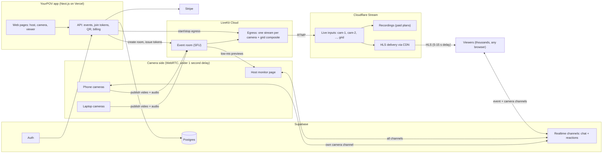

# YourPOV — Architecture

_Status: v1 draft (proposed). Reasoning for each choice is in `DECISIONS.md`._

## 1. Product overview

**Problem.** Event livestreams (weddings, parties, graduations) usually use one phone. Remote viewers miss most of what happens, and nobody can choose what to look at.

**Idea.** Turn every guest's phone or laptop into a camera for one shared stream. Viewers watch from any browser, switch between cameras, see all cameras at once in a grid, and react to the whole event or to one camera.

### Roles

| Role | Device | What they do |
|---|---|---|
| **Host** | Phone or laptop | Creates the event, shares the QR code, manages cameras (remove, mute, rename), picks the audio source, pays for the plan |
| **Camera operator** | Phone or laptop browser | Scans the QR code, streams camera + mic, can mute own mic, sees reactions for their own camera |
| **Viewer** | Any browser | Watches one camera or the grid, switches cameras, chats and reacts to the event or one camera |

### MVP scope

In: event creation, QR join, phone + laptop cameras, mic mute, camera switching, grid view, host audio-source selection, chat and reactions (event-wide and per camera), scale to thousands of viewers, recordings on paid plans.

Out (later): native apps, AI features, pro camera ingest, virtual gifts. See section 12.

## 2. System diagram



## 3. Two delivery paths

The system has two separate paths because they have different needs.

| | Camera side | Audience side |
|---|---|---|
| Who | Host + camera operators (dozens) | Viewers (thousands) |
| Technology | WebRTC via LiveKit room | HLS via Cloudflare Stream CDN |
| Delay | Under 1 second | About 5-15 seconds |
| Why | Two-way, interactive, low delay | Cheap and scalable to very large audiences |

The bridge between them is **LiveKit egress**: it converts each camera, plus a grid composite, into a stream pushed to a Cloudflare Stream live input.

During the early spike (Phase 1), viewers can join the LiveKit room directly over WebRTC. The viewer page only swaps its player when moving to HLS in Phase 3; the camera side does not change.

## 4. Camera side (ingest)

- Cameras join from the browser. No app install. Works on phones (iOS Safari, Android Chrome) and laptops.
- **Join flow:** host shows a QR code, which is a link like `https://<domain>/e/<eventCode>/camera`. The API checks the event and plan limits, then issues a short-lived LiveKit token with the `camera` role.
- **Device picker:** choose camera and microphone (laptops often have several). Phones can flip front/back.
- **Mic mute:** camera operators mute/unmute themselves with a clear on-screen indicator. The host can mute any camera remotely.
- **Simulcast** is on, so the host monitor receives low-resolution previews of all cameras.
- **Phone reliability:**
  - iOS stops the camera when the screen locks or the browser goes to the background. Use the Wake Lock API and show a "keep this screen open" banner.
  - Default to 720p to limit battery drain and heat.
  - Recommend cellular data over venue Wi-Fi; show a connection-quality indicator.
  - Camera access requires HTTPS.
- **Camera health** (battery, network quality) is reported to the host monitor.

## 5. Audience side (delivery)

- Each camera and the grid become one Cloudflare Stream live input. Viewers play them with **hls.js** (native HLS on iOS Safari).
- **Switching cameras** means switching which HLS source the player loads.
- **Grid view ("security guard" view):** LiveKit RoomComposite egress combines all cameras into one grid video on the server. Viewers download one stream, not N, so the grid works well on phones. The grid layout can later be customized with a LiveKit custom template (a web page).

## 6. Audio

Many microphones cannot play at once.

- In single-camera view, viewers hear that camera's audio by default.
- The host picks an **audio source** (for example the phone nearest the speakers). It is used for the grid view and optionally as the audio for every camera.
- Muted cameras send no audio.

## 7. Chat and reactions

Viewers are not in the LiveKit room, so chat runs on a separate real-time service: **Supabase Realtime** (alternatives: Ably, Cloudflare Durable Objects).

### Channels

```
event:<eventId>              whole-event chat and reactions
event:<eventId>:cam:<camId>  chat and reactions for one camera
```

- Viewers subscribe to the event channel plus the channel of the camera they are watching. Switching cameras switches the camera subscription.
- Comment box toggle: **To everyone** / **To this camera**.
- Grid view shows the event channel; per-camera reaction counts can float over each tile.
- Camera operators subscribe to their own camera channel and see reactions and comments live, so viewers can direct them.
- The host sees all channels.

### Scale

- Reactions are **batched on the server** into counts per channel per second (for example "❤️ ×240"), not sent one by one.
- Rate limits per viewer; slow mode for chat when busy.
- Viewers are 5-15 s behind the cameras, so operators see reactions to moments from about 10 s ago. The operator UI should make this clear.
- Chat messages are stored in Postgres so they can appear in replays.

## 8. Backend and data

- **Next.js (TypeScript)** app on **Vercel**: web pages plus API routes.
- **Supabase**: Postgres database, authentication (hosts need accounts; viewers and camera operators can be anonymous with a display name), Realtime.

### Core entities (draft)

| Entity | Key fields |
|---|---|
| `users` | id, email, plan |
| `events` | id, host_id, code, title, status (scheduled/live/ended), plan_tier, audio_source_camera_id, starts_at |
| `cameras` | id, event_id, label, operator_name, device_type (phone/laptop), status, livekit_participant_id, stream_input_id |
| `messages` | id, event_id, camera_id (null = whole event), author_name, body, created_at |
| `reaction_counts` | event_id, camera_id, emoji, bucket_second, count |
| `recordings` | id, event_id, camera_id (null = grid), stream_video_id, duration |
| `subscriptions` | user_id, stripe_customer_id, tier, status |

### Security

- Event codes are long and random so links cannot be guessed.
- LiveKit tokens are issued by the API only, short-lived, and scoped to one room and one role.
- The host can remove cameras and delete messages or ban viewers.
- Optional viewer password for private events.

## 9. Plans and paywall (draft)

Costs grow mainly with **viewer minutes**, then with cameras and recording. Pricing should follow that.

| | Free | Paid tiers (per event or subscription) |
|---|---|---|
| Cameras | 2-3 | More cameras per tier |
| Viewers | Small cap (for example 50) | Larger caps up to thousands |
| Grid view | Yes | Yes |
| Recording / replay | No | Yes, per camera + grid |

Payments via **Stripe Checkout** (subscriptions and one-time event passes).

## 10. Recording and replay

- Cloudflare Stream records each live input automatically (billed as minutes stored). Recording is only enabled on paid plans.
- Store a start timestamp for every camera so replays can be synced and viewers can switch cameras in the replay.

## 11. Infrastructure, testing, costs

### Services

| Need | Service |
|---|---|
| Web app + API | Vercel |
| Camera side (WebRTC) | LiveKit Cloud |
| Audience delivery + recording | Cloudflare Stream |
| Database, auth, realtime | Supabase |
| Payments | Stripe |
| Extra file storage (if needed) | Cloudflare R2 |

Environments: local, staging, production. Each has its own keys in `.env` files (never committed).

### Testing

- **Unit tests** for API logic (token issuing, plan limits).
- **Playwright end-to-end tests** with Chrome's fake camera (`--use-fake-device-for-media-stream`, `--use-fake-ui-for-media-stream`): open several camera pages and viewer pages at once, then check that switching cameras, grid view, mute, and per-camera chat work.
- **Manual device matrix** before each release: iPhone Safari, Android Chrome, macOS/Windows laptop, on Wi-Fi and cellular.
- GitHub Actions runs lint and tests on every PR.

### Cost drivers (check current pricing before relying on these)

- Cloudflare Stream: $1 per 1,000 minutes delivered, $5/month per 1,000 minutes stored. Example: 2,000 viewers × 3 h = 360,000 minutes, about $360 per event.
- LiveKit: WebRTC minutes, bandwidth, and transcode minutes for egress (about cameras + 1 grid × event length). Free plan covers development only.
- Supabase, Vercel: free tiers during development.

## 12. Delivery phases

1. **Spike:** a phone and a laptop publish into a LiveKit room; one watch page (WebRTC); mic mute. Prove it on real devices over cellular.
2. **Multi-camera event:** create event, QR join, device picker, host monitor, remote mute, camera labels, audio-source picker.
3. **Scale path:** egress to Cloudflare Stream, grid composite, HLS viewer page with camera switching and grid.
4. **Chat and reactions:** Supabase Realtime channels (event + per camera), batching, basic moderation.
5. **Accounts and paywall:** host accounts, Stripe, plan limits.
6. **Recording and replay:** paid-plan recordings, synced multi-camera replay.

## 13. Risks

- iOS browser limitations (screen lock, background tabs, battery, heat).
- Poor venue connectivity for camera phones.
- Egress and delivery costs at large audiences; pricing must cover them.
- Viewer delay (5-15 s) makes live interaction with camera operators feel slower.
- Privacy and consent of people being filmed.

## 14. Open questions

- Final pricing model: per event, subscription, or both?
- Maximum cameras per event?
- Do viewers need accounts, or only a display name?
- Which events to target first (weddings only, or any event)?
- Domain name.
